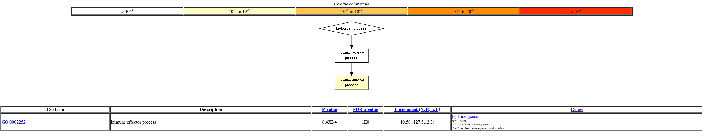

DSUITE
================
2024-02-13

- [Sample selection and filtering](#sample-selection-and-filtering)

AIM1: testing for introgression from Sarda/Nera (“domestic breeds”) into
European Mouflon on Sardinia

## Sample selection and filtering

The following samples are selected:

- Montes (Sardinia)
- Ogliastra (Sardinia)
- Corsica (Corsica)
- Sarda (Domestic)
- Nera (Domestic)
- Argali (Outgroup)

The subsetted VCF is filtered for:

- Fmissing\<0.1
- SNPs

``` bash
#!/bin/bash -l
#SBATCH -A uppmax2023-2-31 -M snowy
#SBATCH -p core -n 4
#SBATCH -J bcftools_subset
#SBATCH -t 1-00:00:00

module load bioinfo-tools bcftools/1.14

INPUT="Mouflon_domestic_argali.Q30.sorted.G5.D3.noIndel.annot.repma.snps.autos"
OUTPUT="Sarda_Nera_Montes_Ogliastra_Corsica_Argali.Q30.sorted.G5.D3.noIndel.annot.repma.autos"
SAMPLE="ARG10-4,ARG19,ARG20,ARG2-1,ARG3-1,ARG8-2,Corsica-M1,Corsican-mouflon-N00,Corsican-Mouflon-N43,Corsican-mouflon-N47,Corsican-mouflon-N76,Corsican-mouflon-N77,Corsican-mouflon-N83,Corsican-mouflon-N85,Corsican-mouflon-N90,Corsican-mouflon-N96,Corsican-mouflon-N97,Montes-1,Montes-2,Montes-3,Montes-4,Montes-5,Montes-6,Ogliastra-11,Ogliastra-12,Ogliastra-13,Ogliastra-14,Ogliastra-15,Ogliastra-18,Ogliastra-19,Ogliastra-1,Ogliastra-3,Ogliastra-4,Ogliastra-6,Ogliastra-9,Ogliastra-17,NeraSheep-183-F,NeraSheep-227-D,NeraSheep-227-F,NeraSheep-435-F,NeraSheep-450-F,NeraSheep-450-SO,NeraSheep-ISEDDU-SO,NeraSheep-P252,NeraSheep-P435,SardaSheep-1,SardaSheep-2,SardaSheep-3,SardaSheep-4,SardaSheep-5,SardaSheep-6"
DIR="/proj/sheep_processing/private/marianne/VCF"
OUTDIR="/proj/snic2020-2-10/private/Analyses/marianne/PROJECTS/EuropeanMouflon/DSUITE"
autos="/proj/snic2020-2-10/private/Data/Non-Human/Animals/sheep/ref_seqs/ARS-UI_Ramb_v2.0/RepeatMasker/GCF_016772045.1_ARS-UI_Ramb_v2.0_genomic.autos.bed"


bcftools view -s $SAMPLE -Ob -o $OUTDIR/${OUTPUT}.bcf $DIR/${INPUT}.bcf
bcftools index $OUTDIR/${OUTPUT}.bcf

#Biallelic SNPS only
bcftools view -m2 -M2 -v snps $OUTDIR/${OUTPUT}.bcf -Ob -o $TMPDIR/${OUTPUT}.snps.bcf
bcftools index $TMPDIR/${OUTPUT}.snps.bcf

#Remove SNPS marked as SNPs in removed samples
bcftools view -e 'count(GT="0/0")+count(GT="./")=(N_SAMPLES)' $TMPDIR/${OUTPUT}.snps.bcf -Ob -o $OUTDIR/${OUTPUT}.snps.bcf
bcftools index $OUTDIR/${OUTPUT}.snps.bcf

bcftools view -i 'F_MISSING<0.1' $OUTDIR/${OUTPUT}.snps.bcf -Ob -o $OUTDIR/${OUTPUT}.snps.Fmiss0.1.bcf
bcftools index $OUTDIR/${OUTPUT}.snps.Fmiss0.1.bcf
```

To allow parallelisation, the VCF is split per chromosome.

``` bash
#!/bin/bash -l

module load bioinfo-tools bcftools

DIR="/proj/snic2020-2-10/private/Analyses/marianne/PROJECTS/EuropeanMouflon/DSUITE/"
INPUT="Sarda_Nera_Montes_Ogliastra_Corsica_Argali.Q30.sorted.G5.D3.noIndel.annot.repma.autos.snps.Fmiss0.1"

cd $DIR

for chrom in NC_056054.1 NC_056055.1 NC_056056.1 NC_056057.1 NC_056058.1 NC_056059.1 NC_056060.1 NC_056061.1 NC_056062.1 NC_056063.1 NC_056064.1 NC_056065.1 NC_056066.1 NC_056067.1 NC_056068.1 NC_056069.1 NC_056070.1 NC_056071.1 NC_056072.1 NC_056073.1 NC_056074.1 NC_056075.1 NC_056076.1 NC_056077.1 NC_056078.1 NC_056079.1
do
  bcftools view $INPUT.bcf -r $chrom -Oz -o $INPUT.${chrom}.vcf.gz
done
```

Dsuite is run per chromosome. The `SETS` file is a tab-delimited file
containing the sample ID (column 1) and group identifier (column 2). The
outgroup (Argali) has group identifier `Outgroup`.

A snippet from the file:

``` bash
#!/bin/bash -l
#SBATCH -A uppmax2023-2-31 -M snowy
#SBATCH -p core -n 2
#SBATCH -J DSUITE
#SBATCH -t 04:00:00

Dsuite="/proj/snic2020-2-10/private/Analyses/marianne/PROJECTS/EuropeanMouflon/DSUITE/Dsuite/Build/Dsuite"
DtriosParallel="/proj/snic2020-2-10/private/Analyses/marianne/PROJECTS/EuropeanMouflon/DSUITE/Dsuite/utils/DtriosParallel"
SETS="/proj/snic2020-2-10/private/Analyses/marianne/PROJECTS/EuropeanMouflon/DSUITE/Domestic_Corsica_Sardinia.txt"
VCF_FILE=$1
CHROM=$(echo $VCF_FILE| cut -d "." -f 13)

$Dsuite Dtrios $VCF_FILE $SETS -n $CHROM
```

This shows significant introgression from Nera into Sardinia (i.e Montes
and Ogliastra)

| P1       | P2       | P3       | Dstatistic | Z-score  | p-value    | f4-ratio   | BBAA       | ABBA   | BABA   |
|----------|----------|----------|------------|----------|------------|------------|------------|--------|--------|
| Sarda    | Nera     | Corsica  | 0.00173132 | 0.88741  | 0.374858   | 0.00243288 | 1101680.00 | 875470 | 872444 |
| Corsica  | Sardinia | Nera     | 0.00130758 | 0.500944 | 0.61641    | 0.00375348 | 1171860.00 | 836414 | 834229 |
| Sardinia | Corsica  | Sarda    | 0.00242141 | 0.963515 | 0.335289   | 0.00752534 | 1177200.00 | 836536 | 832494 |
| Sarda    | Nera     | Sardinia | 0.00529524 | 3.14325  | 0.00167082 | 0.0121647  | 1102290.00 | 878270 | 869017 |

To test if the elevated D-score can be attributed to specific regions,
Dinvestigate is run.

``` bash
#!/bin/bash -l
#SBATCH -A uppmax2023-2-31 -M snowy
#SBATCH -p core -n 4
#SBATCH -J DSUITE
#SBATCH -t 2-00:00:00

Dsuite="/proj/snic2020-2-10/private/Analyses/marianne/PROJECTS/EuropeanMouflon/DSUITE/Dsuite/Build/Dsuite"
SETS="/proj/snic2020-2-10/private/Analyses/marianne/PROJECTS/EuropeanMouflon/DSUITE/METADATA.txt"
TRIO="/proj/snic2020-2-10/private/Analyses/marianne/PROJECTS/EuropeanMouflon/DSUITE/METADATA_test_trios.txt"

#$Dsuite Dtrios $VCF_FILE $SETS -n $CHROM

$Dsuite Dinvestigate -w 50,25 Sarda_Nera_Montes_Ogliastra_Corsica_Argali.Q30.sorted.G5.D3.noIndel.annot.repma.autos.snps.Fmiss0.1.vcf.gz $SETS $TRIO
```

Which results in the following (only displaying first ten lines):

| chr         | windowStart | windowEnd |        D |      f_d |     f_dM |      d_f |
|:------------|------------:|----------:|---------:|---------:|---------:|---------:|
| NC_056054.1 |       61951 |     84440 | -0.19552 | -0.38073 | -0.21942 | -0.07293 |
| NC_056054.1 |       81385 |     86993 | -0.05033 | -0.39976 | -0.15691 | -0.01080 |
| NC_056054.1 |       84504 |     92553 | -0.12251 | -0.32353 | -0.17665 | -0.03609 |
| NC_056054.1 |       86997 |     97110 | -0.19367 | -0.24609 | -0.17498 | -0.07989 |
| NC_056054.1 |       92578 |    101827 | -0.04945 | -0.06069 | -0.04725 | -0.02200 |
| NC_056054.1 |       97144 |    108144 |  0.08155 |  0.13702 |  0.10470 |  0.04510 |
| NC_056054.1 |      102081 |    116125 | -0.11784 | -0.23670 | -0.14507 | -0.07012 |
| NC_056054.1 |      108754 |    126236 | -0.10459 | -0.13518 | -0.09579 | -0.06626 |
| NC_056054.1 |      116745 |    130709 | -0.00508 | -0.00565 | -0.00411 | -0.00409 |

Annotate introgessed regions using SNPeff.

``` bash
#!/bin/bash -l
#SBATCH -A naiss2023-22-1111
#SBATCH -p core -n 1
#SBATCH -J vcf_annotate
#SBATCH -t 1-00:00:00

module load bioinfo-tools bcftools/1.14 samtools/1.14
module load BEDTools/2.29.2
module load tabix/0.2.6
module load java/OpenJDK_12+32

snpEff='/proj/snic2020-2-10/private/Data/Non-Human/Animals/sheep/ref_seqs/ARS-UI_Ramb_v2.0/snpEff/snpEff-5.0/snpEff'

java -Xmx8g -jar ${snpEff}.jar -treatAllAsProteinCoding -v -d -lof ARS-UI_Ramb_v2.0 -i bed Sarda_Nera_Sardinia_localFstats__50_25.sorted.bed > Sarda_Nera_Sardinia_localFstats__50_25.sorted.annotated.bed
```

Merge snpeff annotation and original BED file.  
1. First remove headers of snpeff annotation file `(tail -n +4)`  
2. Merge using join

``` bash
join -j 2 -o 1.1,1.2,1.3,1.4,2.5,2.6,2.7 Sarda_Nera_Sardinia_localFstats__50_25.sorted.annotated.noheader.bed Sarda_Nera_Sardinia_localFstats__50_25.sorted.bed > Sarda_Nera_Sardinia_localFstats__50_25.merged.annotated.bed
```

Extract 1% top results (based on f_dM).

``` bash
awk '{print $6}' Sarda_Nera_Sardinia_localFstats__50_25.merged.annotated.bed | sort -n | awk 'BEGIN{c=0} length($0){a[c]=$0;c++}END{p5=(c/100*1); p5=p5%1?int(p5)+1:p5; print a[c-p5-1]}' #(find top 1% outliers)
awk '$6>=0.630046' Sarda_Nera_Sardinia_localFstats__50_25.merged.annotated.bed | grep -o -P '.Gene.{0,50}' | cut -d ":" -f2 | sort | uniq (top 1%)
```

Extract 0.1% top results.

``` bash
awk '{print $6}' Sarda_Nera_Sardinia_localFstats__50_25.merged.annotated.bed | sort -n | awk 'BEGIN{c=0} length($0){a[c]=$0;c++}END{p5=(c/100*0.1); p5=p5%1?int(p5)+1:p5; print a[c-p5-1]}' #(find top 0.1% outliers)
awk '$6>=0.805553' Sarda_Nera_Sardinia_localFstats__50_25.merged.annotated.bed | grep -o -P '.Gene.{0,50}' | cut -d ":" -f2 | sort | uniq
```

Translate genes with ensemble biomart:
<https://www.ensembl.org/biomart/martview/0d326bb001e275076ec0b17a8c25a189>

Use gene names in GOrilla:
<https://cbl-gorilla.cs.technion.ac.il/GOrilla/h6ptkz0c/GOResults.html#genes_info>

Find GO enrichment!

<figure>

<figcaption aria-hidden="true">Results of GO analysis using Rattus
norvegicus as reference</figcaption>
</figure>
